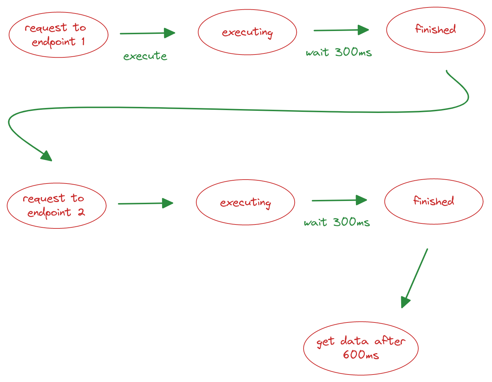

# Programação assíncrona com corrotinas kotlin

  Antes de entrarmos no assunto corrotina vamos dar uma pequena introdução sobre as diferenças entre programação síncrona e assíncrona ou se já souber sobre os conceitos de progração assíncrona pule direto para corrotinas[link].

  ## singletasking vs. multitasking

  imagine o cenário dos primeiros sistemas operacionais que suportavam a execução de apenas um processo por vez, tínhamos um fluxo linear como na imagem abaixo:

  

  apenas ao final da execução da tarefa que outra poderia ser carregada na memória e executada

  um processador executa uma operação na escala de nanosegundos enquanto uma operação de rede por exemplo consideramos a escala de milisegundos, com isso se fizermos uma requisição de forma síncrona o processador/thread ficará ocioso por muito tempo e como sabemos tempo é bem precioso.

  vamos a um exemplo do mundo real, digamos que voce tem um card em sua aplicação que precisa buscar informações de dois endpoints diferentes e cada requisição demore 300 milisegundos, seria necessário esperar a primeira requisição ser finalizada pra então iniciar a segunda levando um total de 600ms para ter todos os dados necessários

  

  A solução encontrada para este problema foi fazer com que o processador possa suspender a execução de uma tarefa que estivesse aguardando dados externos ou algum evento e passar a executar outra tarefa, a isso dá-se o nome de [preempção](https://www.geeksforgeeks.org/preemptive-and-non-preemptive-scheduling/)
  veja no fluxograma abaixo:


## Oque são corrotinas kotlin e quais as diferenças com Threads

Corrotinas são processos concorrentes que rodam na mesma Thread e que passam o fluxo uma para outra (CO)perando uma com a outra

Threads tem a desvantagem de consumirem mais recursos da máquina pois é necessário passar a informação de uma thread para a outra

podemos dizer que corrotinas são threads “leves” pois consomem menos recursos, entretanto multiplas Threads são necessárias quando precisamos executar um processo "pesado" como cálculos grandes ou leitura e escrita em arquivos por exemplo.

chega de papo vamos pro código veja o exemplo abaixo de uma corrotina:

```kotlin
fun main() {
    GlobalScope.launch {
        delay(1000)
        print("message sent after 1 second")
    }
}
```

toda corrotina precisa ser executada dentro de um escopo(`GlobalScope`) e também necessita de um coroutine builder que nesse caso usamos o `launch`. iremos citar outros escopos e coroutine builders ao longo deste artigo. perceba também no próximo exemplo que todo escopo de corrotina retorna um `Job`:

```kotlin
fun main() {
    val job  = GlobalScope.launch {
        delay(1000)
        print("message sent after 1 second")
    }

    job.cancel()
}
```
uma corrotina pode ser cancelada de duas formas, a primeira é explícitamente atraves do `job.cancel()` ou quando seu escopo "pai" é finalizado, nesse caso o escopo pai é a função main.

Podemos também escolher em qual momento devemos iniciar nossa corrotina dessa forma:

```kotlin
const val x = 2

fun main() {
    val job = GlobalScope.launch(start = CoroutineStart.LAZY) {
        delay(1000)
        print("message sent after 1 second")
    }

    if (x == 2) {
        job.start()
    }
}
```

veja que adicionamos um parâmetro `start` ao coroutine builder com o valor `CoroutineStart.LAZY`, isso fará com que a corrotina inicie somente com a chamada da função `job.start()`

agora que vimos uma introdução sobre corrotinas vamos resolver o problema de múltiplas requisições sequênciais. vamos implementar a forma menos performática fazendo duas requisições sequênciais e depois implementar a forma mais performática usando concorrência.

o primeiro passo será criar uma função pra simular um requisição

```kotlin
suspend fun performFakeFetch(number: Int, time: Long? = 300L) {
    println("request $number starts work")
    if (time != null) {
        delay(time)
    }
    println("request $number has finished")
}

```

nessa função cada requisição demorará 300 milisegundos, agora criaremos uma função simples para calcular o tempo de execução total:

```kotlin
fun calculateExecutionTime(initial: Long) {
    val now = System.currentTimeMillis()
    println("the execution time is: ${now - initial}")
}
```

agora observe a função abaixo:
```kotlin
fun main() = runBlocking<Unit> {
    val initial = System.currentTimeMillis()
    performFakeFetch(1)
    performFakeFetch(2)
    calculateExecutionTime(initial)
}
```

primeiro de tudo veja que usamos um coroutine builder diferente neste caso chamado `runBlocking` ele é usado quando é necessário um escopo de corrotina para executar processos sequenciais, basicamente oque ele faz é travar a Thread até que a corrotina termine, sem isso nossa função main não aguardaria o retorno das nossas funções assíncronas e seria finalizada sem ter uma resposta, raramente você o usará no dia a dia, mas neste caso ele supre a nossa necessidade de criar um escopo de corrotina para podermos executar funções assíncronas(`suspend`)

este é o resultado da execução da função acima:
```bash
request 1 starts work
request 1 has finished
request 2 starts work
request 2 has finished
the execution time is: 607

Process finished with exit code 0
```

agora veremos como implementar essas duas requisições de forma concorrente, veja o código abaixo:

```kotlin
fun main() = runBlocking<Unit> {
    println("Main starts")
    val initial = System.currentTimeMillis()
    val job1 = launch {
        performFakeFetch(1, 400)
    }
    val job2 = launch {
        performFakeFetch(2)
    }
    job1.join()
    job2.join()
    calculateExecutionTime(initial)
}
```

Perceba que no código acima cada requisição foi executada em uma corrotina diferente e com tempos diferentes, dessa forma os processos rodam de forma concorrente e não disperdiçam tempo do processador, tornando a operação como um todo mais performática.

um ponto importante de salientar neste trecho de código é o `.join()`, esse método faz com que o scopo pai espere até que o `Job` seja finalizado para então executar a função `calculateExecutionTime()`

ao executar esse código o resultado será este:

```kotlin
Main starts
request 1 starts work
request 2 starts work
request 2 has finished
request 1 has finished
the execution time is: 412

Process finished with exit code 0
```

perceba que foram poupados 200ms de tempo de processador ocioso, esta abordagem faz total diferença na qualidade da sua aplicação.


