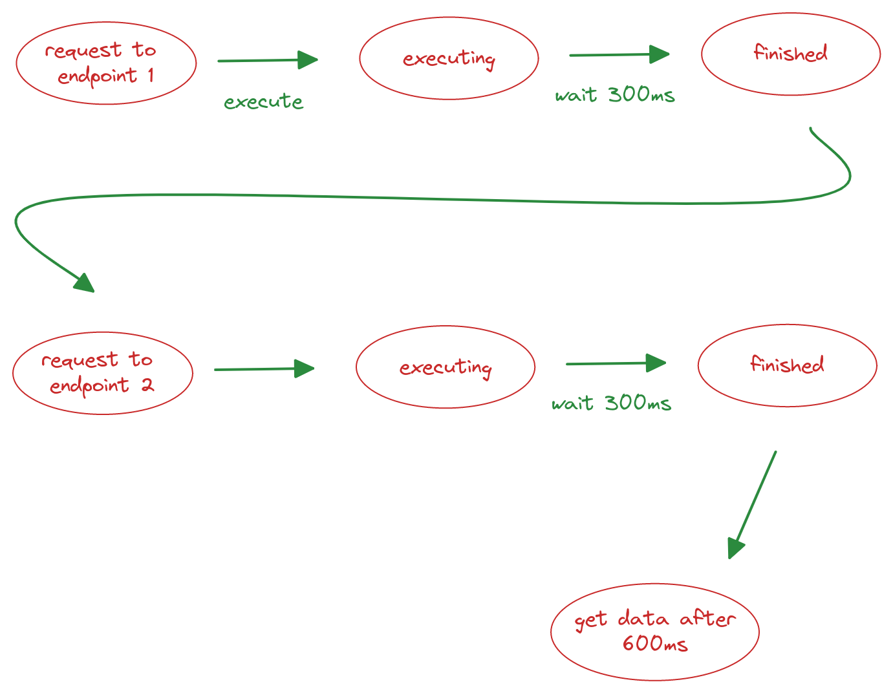

# Asynchronous programming with kotlin coroutines

  Before we get into the subject of coroutines let's give a short introduction to the differences between synchronous and asynchronous programming or if you already know about the concepts of asynchronous programming skip straight to coroutines[link].

  ## singletasking vs. multitasking

  imagine the scenario of early operating systems that supported the execution of only one process at a time, we had a linear flow as in the image below:

  

  only at the end of the task execution that another one could be loaded into memory and executed

  a processor performs an operation on the nanosecond scale while a network operation for example considers the millisecond scale, so if we make a request synchronously the processor/thread will be idle for a long time and as we know time is very precious.

  let's take a real world example, let's say you have a card in your application that needs to fetch information from two different endpoints and each request takes 300 milliseconds, it would be necessary to wait for the first request to be finished and then start the second one taking a total of 600ms to have all the necessary data

  

  The solution to this problem was to make it possible for the processor to suspend the execution of a task that was waiting for external data or some event and start executing another task, this is called [preemption](https://www.geeksforgeeks.org/preemptive-and-non-preemptive-scheduling/)
  see the flow chart below:


## What kotlin coroutines are and how they differ from threads

Coroutines are concurrent processes that run in the same Thread and pass the flow to each other (CO)perating with each other

Threads have the disadvantage of consuming more machine resources because it is necessary to pass information from one thread to another

we can say that coroutines are "light" threads because they consume less resources, however multiple threads are necessary when we need to run a "heavy" process such as large calculations or reading and writing files for example.

Enough talk, let's go to the code. Take a look at the example below of a coroutine:

```kotlin
fun main() {
    GlobalScope.launch {
        delay(1000)
        print("message sent after 1 second")
    }
}
```

every coroutine needs to be executed within a scope (`GlobalScope`) and also needs a coroutine builder which in this case we use `launch`. we will mention other scopes and coroutine builders throughout this article. notice also in the next example that every coroutine scope returns a `Job`:

```kotlin
fun main() {
    val job  = GlobalScope.launch {
        delay(1000)
        print("message sent after 1 second")
    }

    job.cancel()
}
```
A coroutine can be canceled in two ways, the first is explicitly through `job.cancel()` or when its "parent" scope is finished, in which case the parent scope is the main function.

We can also choose at what point to start our coroutine in this way:

```kotlin
const val x = 2

fun main() {
    val job = GlobalScope.launch(start = CoroutineStart.LAZY) {
        delay(1000)
        print("message sent after 1 second")
    }

    if (x == 2) {
        job.start()
    }
}
```

see that we added a `start` parameter to the coroutine builder with the value `CoroutineStart.LAZY`, this will cause the coroutine to start only with the `job.start()` function call

now that we have seen an introduction to coroutines let's solve the problem of multiple sequential requests. we will implement the less performative way by making two sequential requests and then implement the more performative way by using concurrency.

the first step will be to create a function to simulate a request

```kotlin
suspend fun performFakeFetch(number: Int, time: Long? = 300L) {
    println("request $number starts work")
    if (time != null) {
        delay(time)
    }
    println("request $number has finished")
}

```

in this function each request will take 300 milliseconds, now we will create a simple function to calculate the total execution time:

```kotlin
fun calculateExecutionTime(initial: Long) {
    val now = System.currentTimeMillis()
    println("the execution time is: ${now - initial}")
}
```

now look at the function below:
```kotlin
fun main() = runBlocking<Unit> {
    val initial = System.currentTimeMillis()
    performFakeFetch(1)
    performFakeFetch(2)
    calculateExecutionTime(initial)
}
```

see we use a different coroutine builder in this case called `runBlocking`, it's used when you need a coroutine scope to run sequential processes, basically what it does is lock the thread until the coroutine finishes, without that our main function wouldn't wait for our asynchronous functions to return and would be terminated without getting a response, you'll rarely use it in your day to day life, but in this case it fulfills our need to create a coroutine scope so we can run asynchronous functions (`suspend`)

this is the result of executing the above function:
```bash
request 1 starts work
request 1 has finished
request 2 starts work
request 2 has finished
the execution time is: 607

Process finished with exit code 0
```

now we will see how to implement these two requests concurrently, see the code below:

```kotlin
fun main() = runBlocking<Unit> {
    println("Main starts")
    val initial = System.currentTimeMillis()
    val job1 = launch {
        performFakeFetch(1, 400)
    }
    val job2 = launch {
        performFakeFetch(2)
    }
    job1.join()
    job2.join()
    calculateExecutionTime(initial)
}
```

Notice that in the code above each request was executed in a different coroutine and at different times, this way the processes run concurrently and don't waste processor time, making the operation as a whole more performant.

one important point to note in this code snippet is the `.join()`, this method makes the parent scope wait until the `Job` is finished and then runs the `calculateExecutionTime()` function

executing this code will result in the following:

```kotlin
Main starts
request 1 starts work
request 2 starts work
request 2 has finished
request 1 has finished
the execution time is: 412

Process finished with exit code 0
```

Notice that 200ms of idle processor time has been saved, this approach makes a total difference in the quality of your application.


